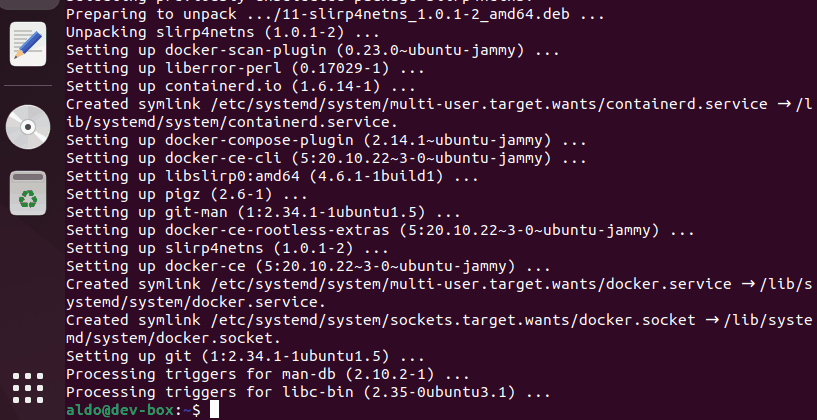

# Actividad 18
## Instalación de Docker y su «hola mundo»
Para installar Docker en mi VM de Ubuntu seguí la secuencia de pasos expuesta en la documentación oficial de Docker.

https://docs.docker.com/engine/install/ubuntu/#set-up-the-repository

En el siguiente gif se verifica que la instalación de Docker ha sido exitosa mediante el hola mundo de Docker:



Como se puede apreciar en el gif, incluso un comando tan simple de Docker como su «hola mundo» necesita anteponer la palabra clave «sudo»:

```
sudo docker run hello-world
```

Esto sucede porque está configurado por defecto para que el único usuario que pueda usar estos comandos sea el root. Lo arreglamos con el siguiente comando:
```
sudo usermod -aG docker <username>
```
Para que tenga efecto se debe cerrar la sesión.


