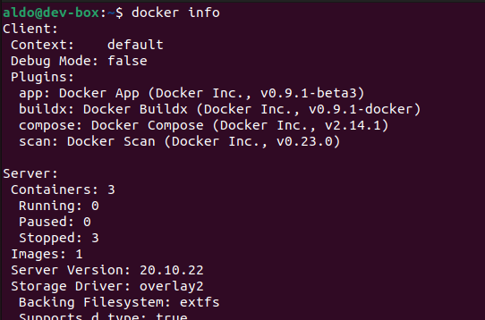
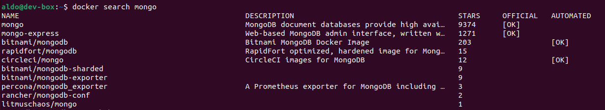
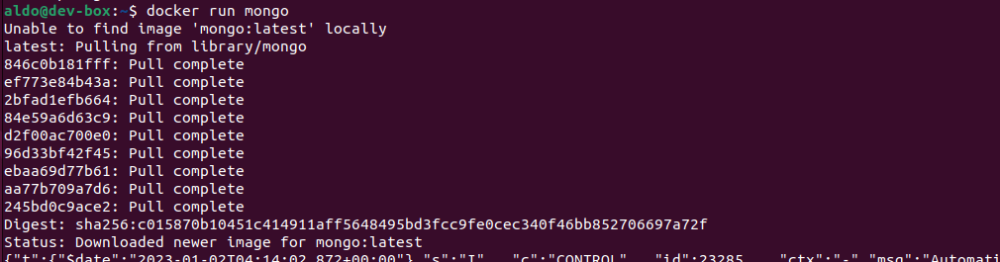
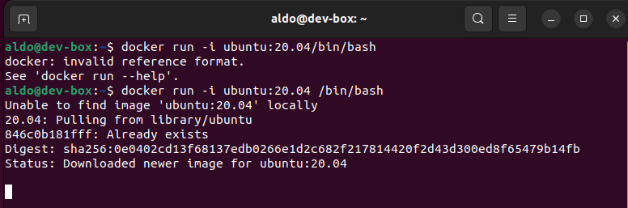
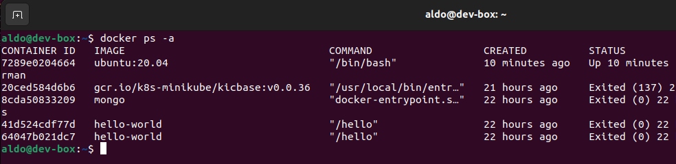
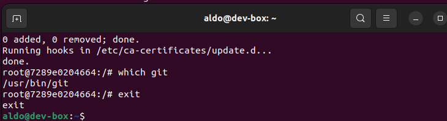
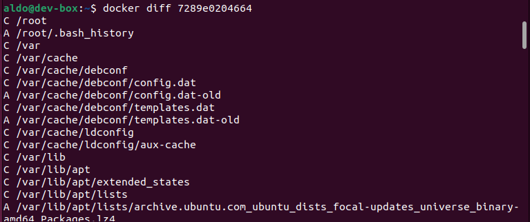
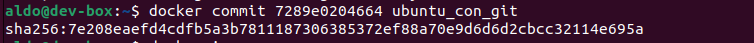
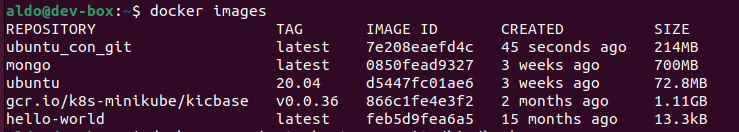
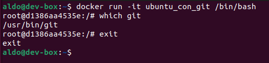

# Actividad 18 <!-- omit in toc -->

- [Instalación de Docker y su «hola mundo»](#instalación-de-docker-y-su-hola-mundo)
- [Ejecutando la aplicación Docker de MongoDB](#ejecutando-la-aplicación-docker-de-mongodb)
- [Creación de imágenes de Docker](#creación-de-imágenes-de-docker)
  - [Docker commit](#docker-commit)
- [Documentación de los comandos que usamos obtenida mediante _\<command\> --help_](#documentación-de-los-comandos-que-usamos-obtenida-mediante-command---help)


## Instalación de Docker y su «hola mundo»

> Instalar Docker significa instalar todos los componentes para que el demonio Docker se ejecute en un equipo todo el tiempo como un servicio.

Para installar Docker en mi VM de Ubuntu seguí la secuencia de pasos expuesta en [la documentación oficial de Docker](https://docs.docker.com/engine/install/ubuntu/#set-up-the-repository).

Una forma de verificar que la instalación de Docker ha sido exitosa es mediante el «hola mundo» de Docker. Véase el siguiente gif:


Como se puede apreciar en el gif, incluso un comando tan simple de Docker como su _hola mundo_ necesita anteponer la palabra clave _sudo_. De lo contrario se niega el permiso.

```
sudo docker run hello-world
```

Esto es así porque está configurado por defecto para que el único usuario que pueda usar estos comandos de Docker sea el root. Le damos el permiso a otro usuario con el siguiente comando:

```
sudo usermod -aG docker <username>
```

Para que tenga efecto se debe cerrar la sesión.

Otra forma de verificar que Docker se ha instalado exitosamente con el comando para pidiéndole información:

```
docker info
``` 



En mi caso figuran 3 contenedores porque ejecuté el _hola mundo_ tres veces.

## Ejecutando la aplicación Docker de MongoDB

> Una **imagen** es un bloque de construcción sin estado (stateless) en el mundo de Docker. Un **contenedor** es una instancia en ejecución de una imagen. Una **aplicación** se proporciona en forma de imagen que se puede descargar de Internet (al igual que el _hola mundo_) y se  ejecuta con Docker como un contenedor.

¿Cómo buscamos la aplicación Docker de MongoDB? Con el siguiente comando:

```
docker search mongo
```


A continuación, ejecutamos la primera aplicación que figura en la lista porque es oficial, tal como se puede ver en la penúltima columna. La operación es la misma que la del _hola mundo_:

```
docker run mongo
```



Eso es todo. La aplicación de MongoDB ya se ha ejecutado como un contendor Docker.

## Creación de imágenes de Docker

### Docker commit

Corremos la aplicación de Ubuntu 20.04 con el comando `docker run -i -t ubuntu:20.04 /bin/bash`. Sin embargo, no nos aparece la línea de comandos propiamente.



Verificamos que el contenedor está corriendo, y lo hacemos en otra ventana del terminal:



Accedemos al contenedor en ejecución de Ubuntu (nos guiamos de [un video de YT](https://www.youtube.com/watch?v=qKXqSsvfpZw)). El comando utilizado es `docker exec -it <container> bash`:


Ya lo tenemos conectado a la línea de comando (ahora lanzamos comandos desde _root@7289e0204664_), así que ahora instalamos el kit de herramienta de Git con los siguientes comandos:

```
apt-get update
apt-get isntall -y git
```
Verificamos que Git se ha instalado en el contenedor de Ubuntu y salimos:



Ahora queremos ver qué archivos han cambiado en el contenedor con respecto al contenido de la imagen de la cual este se instanció originalmente. Para esto usamos el comando `docker diff <container>`. La lista es larga:



Y por último hacemos un commit del contenedor a la imagen:



Listamos las imagenes con el comando `docker images` y nos damos cuenta de que hay una nueva imagen con el nombre de _ubuntu_con_git_. Entonces, **el commit creó una nueva imagen** a partir del contenedor actualizado.



Si corremos ahora un contenedor a partir de la nueva imagen, deberíamos poder comprobar que git se ha instalado usando el comando `which git`. Y así es:




## Documentación de los comandos que usamos obtenida mediante _\<command> --help_
  * run
    ```
    Usage:  docker run [OPTIONS] IMAGE [COMMAND] [ARG...]
    Run a command in a new container
    Options:
    -i, --interactive                    Keep STDIN open even if not
                                       attached      
    -t, --tty                            Allocate a pseudo-TTY  
    ```
  * exec
    ```
    Usage:  docker exec [OPTIONS] CONTAINER COMMAND [ARG...]
    Run a command in a running container
    Options:
    -i, --interactive                    Keep STDIN open even if not
                                       attached
    -t, --tty                            Allocate a pseudo-TTY    
    ```
  * commit
    ```
    Usage:  docker commit [OPTIONS] CONTAINER [REPOSITORY[:TAG]]
    Create a new image from a container's changes
    ```

