# Actividad 18. Introducción a Docker <!-- omit in toc -->

- [Instalación de Docker y su «hola mundo»](#instalación-de-docker-y-su-hola-mundo)
- [Ejecutando la aplicación Docker de MongoDB](#ejecutando-la-aplicación-docker-de-mongodb)
- [Creación de imágenes de Docker](#creación-de-imágenes-de-docker)
  - [Docker commit](#docker-commit)
  - [Dockerfile](#dockerfile)
  - [Aplicación Docker completa](#aplicación-docker-completa)
  - [Variables de entorno](#variables-de-entorno)
  - [Estados del contendor docker](#estados-del-contendor-docker)
- [Redes Docker](#redes-docker)
  - [Servicios en uso](#servicios-en-uso)
  - [Redes de contenedores](#redes-de-contenedores)
  - [Asignación automática de puertos](#asignación-automática-de-puertos)
- [Volumenes Docker](#volumenes-docker)
- [Uso de nombres en Docker](#uso-de-nombres-en-docker)
- [Limpieza en Docker](#limpieza-en-docker)
- [Ejercicios](#ejercicios)
- [Documentación de los comandos que usamos obtenida con la ayuda](#documentación-de-los-comandos-que-usamos-obtenida-con-la-ayuda)


## Instalación de Docker y su «hola mundo»

> Instalar Docker significa instalar todos los componentes para que el demonio Docker se ejecute en un equipo todo el tiempo como un servicio.

Para installar Docker en mi VM de Ubuntu seguí la secuencia de pasos expuesta en [la documentación oficial de Docker](https://docs.docker.com/engine/install/ubuntu/#set-up-the-repository).

Una forma de verificar que la instalación de Docker ha sido exitosa es mediante el «hola mundo» de Docker. Véase el siguiente gif:


Como se puede apreciar en el gif, incluso un comando tan simple de Docker como su _hola mundo_ necesita anteponer la palabra clave _sudo_. De lo contrario se niega el permiso.

```
sudo docker run hello-world
```

Esto es así porque está configurado por defecto para que el único usuario que pueda usar estos comandos de Docker sea el root. Le damos el permiso a otro usuario con el siguiente comando:

```
sudo usermod -aG docker <username>
```

Para que tenga efecto se debe cerrar la sesión.

Otra forma de verificar que Docker se ha instalado exitosamente con el comando para pidiéndole información:

```
docker info
``` 


En mi caso figuran 3 contenedores porque ejecuté el _hola mundo_ tres veces.

## Ejecutando la aplicación Docker de MongoDB

> Una **imagen** es un bloque de construcción sin estado (stateless) en el mundo de Docker. Un **contenedor** es una instancia en ejecución de una imagen. Una **aplicación** se proporciona en forma de imagen que se puede descargar de Internet (al igual que el _hola mundo_) y se  ejecuta con Docker como un contenedor.

¿Cómo buscamos la aplicación Docker de MongoDB? Con el siguiente comando:

```
docker search mongo
```


A continuación, ejecutamos la primera aplicación que figura en la lista porque es oficial, tal como se puede ver en la penúltima columna. La operación es la misma que la del _hola mundo_:

```
docker run mongo
```


Eso es todo. La aplicación de MongoDB ya se ha ejecutado como un contendor Docker.

## Creación de imágenes de Docker

### Docker commit

Corremos la aplicación de Ubuntu 20.04 con el comando `docker run -i -t ubuntu:20.04 /bin/bash`. Sin embargo, no nos aparece la línea de comandos propiamente.


Verificamos que el contenedor está corriendo, y lo hacemos en otra ventana del terminal:


Accedemos al contenedor en ejecución de Ubuntu (nos guiamos de [un video de YT](https://www.youtube.com/watch?v=qKXqSsvfpZw)). El comando utilizado es `docker exec -it <container> bash`:

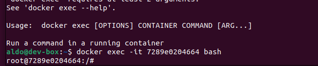

Ya lo tenemos conectado a la línea de comando (ahora lanzamos comandos desde _root@7289e0204664_), así que ahora instalamos el kit de herramienta de Git con los siguientes comandos:

```
apt-get update
apt-get isntall -y git
```
Verificamos que Git se ha instalado en el contenedor de Ubuntu y salimos:


Ahora queremos ver qué archivos han cambiado en el contenedor con respecto al contenido de la imagen de la cual este se instanció originalmente. Para esto usamos el comando `docker diff <container>`. La lista es larga:


Y por último hacemos un commit del contenedor a la imagen:


Listamos las imagenes con el comando `docker images` y nos damos cuenta de que hay una nueva imagen con el nombre de _ubuntu_con_git_. Entonces, **el commit creó una nueva imagen** a partir del contenedor actualizado.


Si corremos ahora un contenedor a partir de la nueva imagen, deberíamos poder comprobar que git se ha instalado usando el comando `which git`. Y así es:


### Dockerfile

Podemos crear una imagen docker de forma automatizada a partir de un archivo de texto que contenga las instruciones que de otra forma tendríamos que ingresar manualmente en el terminal. Este archivo es el Dockerfile. 

Lo creamos con este mismo nombre dentro de un directorio que podemos llamar igual que la imagen deseada, aunque no es necesario. Esto se explica en detalle en [esta página oficial de Docker](https://docs.docker.com/get-started/02_our_app/). Luego lo editamos para que contenga todas las instrucciones según la sintaxis que está documentada en [esta otra página oficial de Docker](https://docs.docker.com/engine/reference/builder/). Por último, ejecutamos el comando `docker build -t <image_name> .` y sí, el punto es parte del comando. (Es una forma abreviada de que en el comando se tome como parámetro PATH la dirección actual desde la que se ejecuta dicho comando).

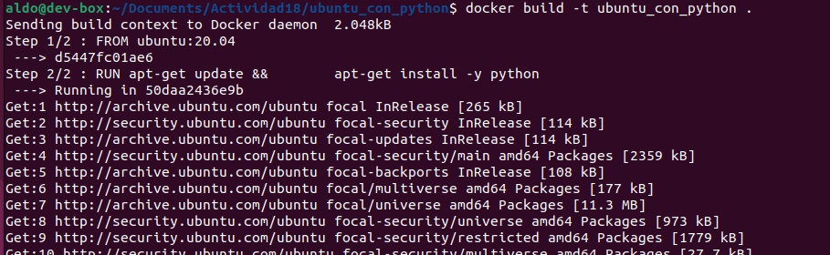

Finalmente, comprobamos que la imagen ha sido creada con `docker images`:

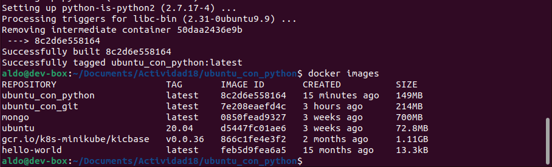

### Aplicación Docker completa

Vamos a construir una aplicación con un programa simple de python dentro (hola.py) como una imagen docker y luego iniciaremos esta aplicación para ejecutar el programa. Para hacerlo necesitamos responder estas preguntas:

* ¿Qué imagen base debe usarse?
* ¿Cómo instalar el intérprete de Python?
* ¿Cómo incluir hola.py en la imagen ?
* ¿Cómo iniciar la aplicación?

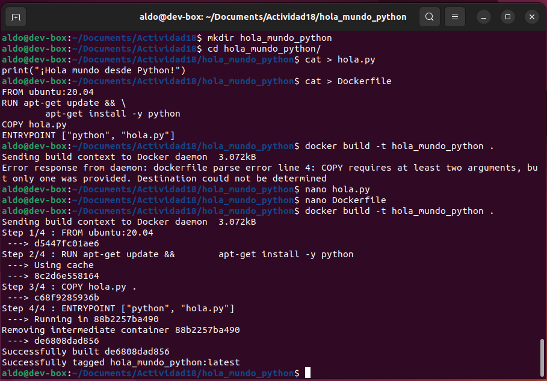

Faltó un punto al final de la línea `COPY hola.py` del Dockerfile y eso dio un error.


Ahora ejecutamos la aplicación. Pero tenemos un problema con la codificación:

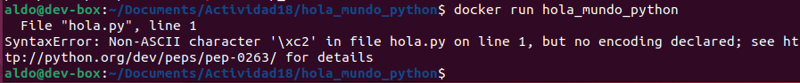

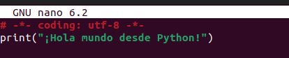

Puesto que la imagen que habíamos creado tiene una copia de nuestra aplicación python, para que la modificación que hicimos tenga efecto debemos crear otra vez la imagen.

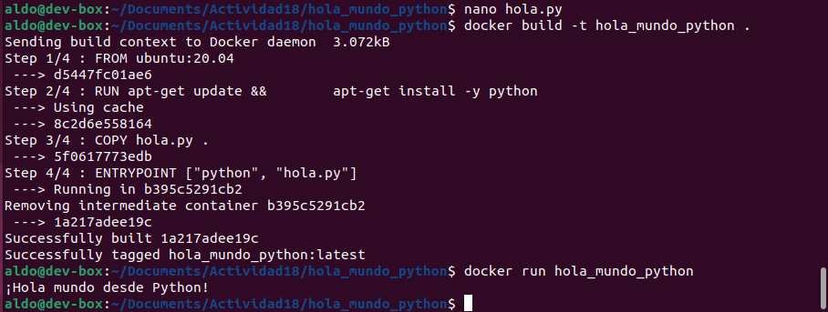

### Variables de entorno

Editamos el código del _hola mundo_ de python:

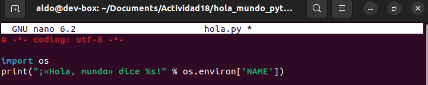

Construimos la imagen, instanciamos un contenedor pasándole la variable NAME y la aplicación imprime un mensaje usando el valor de la variable que le pasamos:

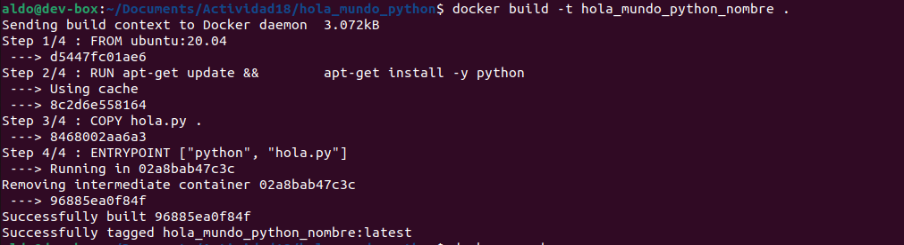
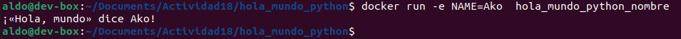

Alternativamente, podemos editar el Dockerfile para que la variable NAME sea por defecto _Ako_.

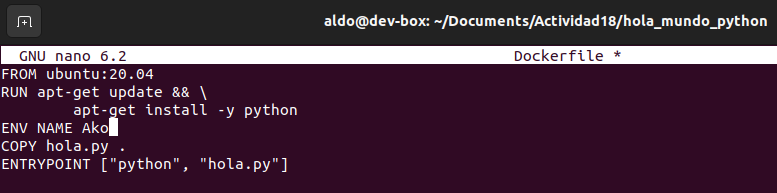

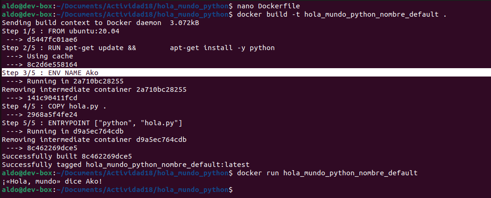

Pero el valor de esta variable se puede cambiar como hicimos antes:

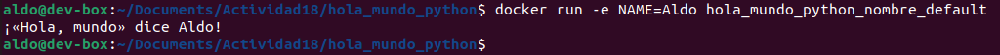

### Estados del contendor docker

Ahora queremos ejecutar una aplicación en segundo plano como un servidor (o como demonio). Esto lo conseguimos con la opción `-d` o `--detach`, que en inglés significa ‘despegar’ o ‘separar’.

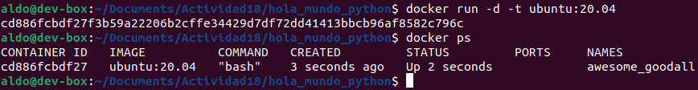

Con el comando `docker ps -a` podemos ver todos los contenedores, incluso de los que ya se salió:

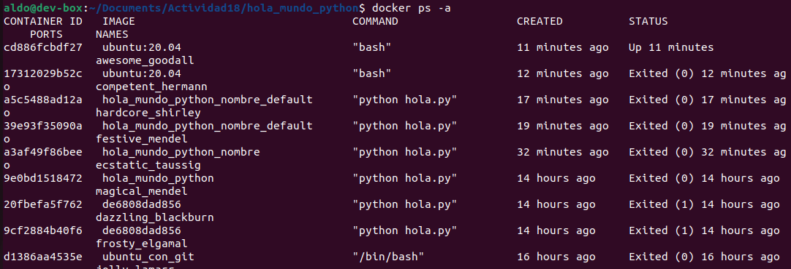

El siguiente diagrama muestra todos los estados de un contendor y las transiciones posibles entre ellos:

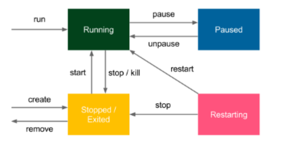

Vamos a detener el contenedor de Ubuntu que creamos como servidor:

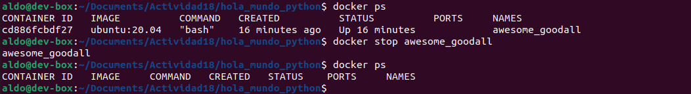

En vez de usar su ID usamos su nombre aleatorio que se autogeneró porque así aprovechamos el autocompletado (tecla TAB) y vamos más rápido.

## Redes Docker

> Si queremos ejecutar un sitio web, un servicio web, una base de datos o un servidor de caché dentro de un contenedor Docker, primero debemos comprender cómo ejecutar un servicio y **exponer su puerto** a otras aplicaciones.

### Servicios en uso

Corremos la aplicación TomCat como demonio y verificamos que no tenga errores viendo sus logs:


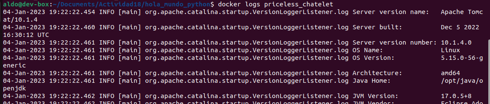

Pero no podemos usar este contenedor como servidor porque no hemos especificado los puertos de comunicación. Entonces, lo detenemos y creamos uno nuevo:

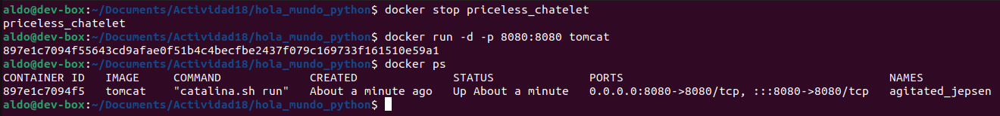

Abrimos en el navegador el host local en el puerto 8080 y vemos una interfaz de Tomcat, pero en la página dice  _Not found_:

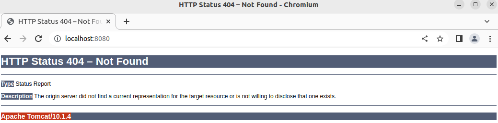

### Redes de contenedores

Comrobamos que Docker tiene una interfaz de red llamada _docker0_ con el comando `ifconfig`:

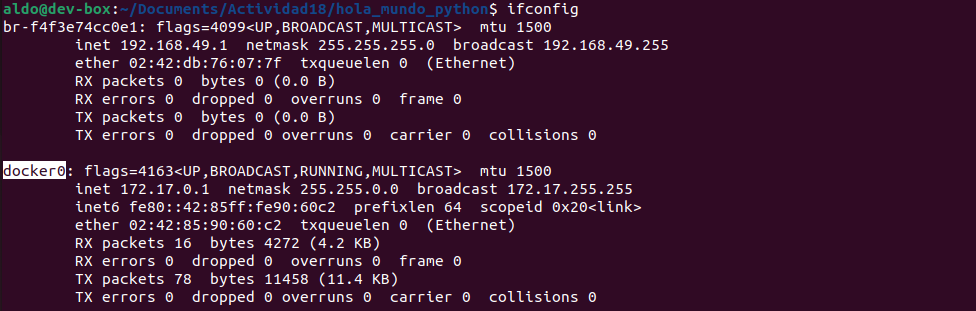

Inspeccionamos el contenedor tomcat que habíamos creado con `docker inspect <container_name>`. Nos interesa en este momento su configuiración de red (NetworkSettings):

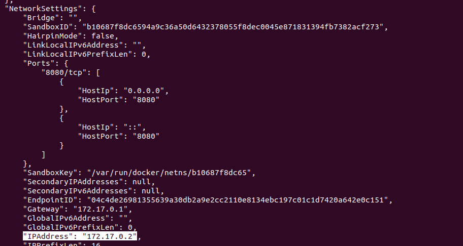

Las redes en Docker se pueden administrar con `docker network <command>`. Aquí listamos las redes con `docker network -ls`:

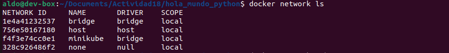

En la actividad se nos dice que hay tres tipos de red: none, host y bridge. Sin embargo, al haber instalado Minicube aparece una cuarta opción en mi caso: minicube. (¿Por qué?)

### Asignación automática de puertos

A continuación intentamos crear otro contenedor tomcat con el mismo puerto 8080, pero nos sale un error porque obviamente ya está reservado para el anterior contenedor. Por eso dejamos que Docker elija automáticamente qué puerto usar, y en nuestro caso resulta siendo el puerto 32768:

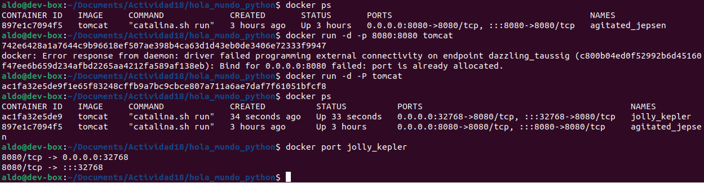

## Volumenes Docker

Vamos a ver cómo proporcionar una capa de **persistencia** a nuestros contenedores mediante volúmenes Docker.

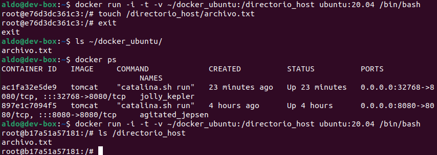

## Uso de nombres en Docker

Para crear un contenedor con un nombre elegido por nosotros se usa el parámetro `--name` en el siguiente comando:

```
docker run [opt] --name <container_name> <image_name>
```

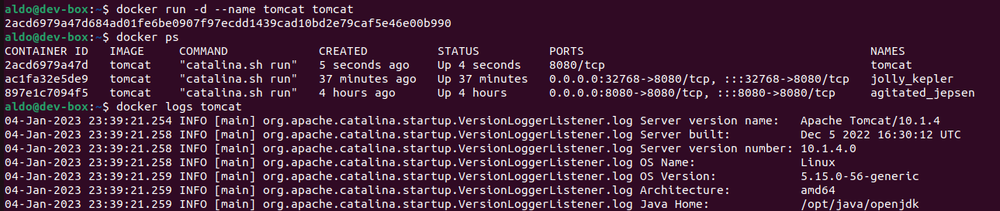

También se le puede dar nombre a una imágen, pero no se le dice nombre sino etiqueta. Ya se ha etiquetado una imagen antes, por ejemplo, con el nombre _hola_mundo_python_.


## Limpieza en Docker

Podemos limpiar los contenedores de dos sencillas formas:
* Uno por uno (solo si está detenido): `docker rm <container_name>`

* Todos los detenidos: `docker container prune` (prune ‘podar’)

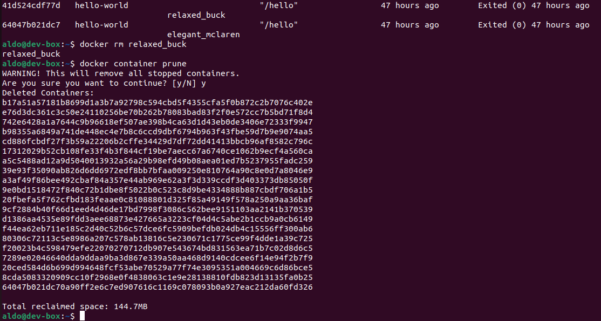

La limpieza de contenedores libera espacio en memoria. Al final de la captura vemos que hemos liberado casi 150 MB. Considerando la cantidad de contenedores que hay, podemos decir que son muy ligeros.

La limpieza de imagenes es muy similar a la limpieza de contenedores. Podemos limpiar las imágenes de dos sencillas formas:

* Una por una: `docker rmi <image_name>`

* Todas: `docker image prune` (prune ‘podar’)

También se pueden limpiar volúmenes, pero eso no forma parte de la actividad.

## Ejercicios

(No puedo hacerlos todavía porque no manejo REST ni FLASK).


## Documentación de los comandos que usamos obtenida con la ayuda

Existe una página oficial de Docker que lista todos los comandos y cada uno tiene un hipervínculo que lleva a otra página que lo detalla. Pero yo listé solo lo que se usó en esta actividad según lo que sale al usar la ayuda (mediante _\<command> --help_):

* run
    ```
    Usage:  docker run [OPTIONS] IMAGE [COMMAND] [ARG...]
    Run a command in a new container
    Options:
    -i, --interactive                    Keep STDIN open even if not attached      
    -t, --tty                            Allocate a pseudo-TTY
    -e, --env list                       Set environment variables
    -d, --detach                         Run container in background and print container ID</pre>
    ```
* exec
    ```
    Usage:  docker exec [OPTIONS] CONTAINER COMMAND [ARG...]
    Run a command in a running container
    Options:
    -i, --interactive                    Keep STDIN open even if not attached
    -t, --tty                            Allocate a pseudo-TTY    
    ```
* commit
    ```
    Usage:  docker commit [OPTIONS] CONTAINER [REPOSITORY[:TAG]]
    Create a new image from a container's changes
    ```
* build
    ```
    Usage:  docker build [OPTIONS] PATH | URL | -
    Build an image from a Dockerfile
    ```
* ps
    ```
    Usage:  docker ps [OPTIONS]
    List containers
    Options:
    -a, --all             Show all containers (default shows just running)
    ```
* stop
    ```
    Usage:  docker stop [OPTIONS] CONTAINER [CONTAINER...]
    Stop one or more running containers
    ```
* network
    ```
    Usage:  docker network COMMAND
    Manage networks
    Commands:
        connect     Connect a container to a network
        create      Create a network
        disconnect  Disconnect a container from a network
        inspect     Display detailed information on one or more networks
        ls          List networks
        prune       Remove all unused networks
        rm          Remove one or more networks
    ```


