# Actividad 20. Configuración de Jenkins <!-- omit in toc -->

- [Instalación y configuración de Jenkins](#instalación-y-configuración-de-jenkins)
  - [Instalación a partir de una imagen Docker](#instalación-a-partir-de-una-imagen-docker)
  - [Configuración inicial](#configuración-inicial)
- [El «Hola, mundo» de Jenkins](#el-hola-mundo-de-jenkins)
- [Arquitectura de Jenkins](#arquitectura-de-jenkins)
- [Configuración de agentes permanentes](#configuración-de-agentes-permanentes)
- [Prueba de agentes](#prueba-de-agentes)

## Instalación y configuración de Jenkins

> En esta parte nos aseguraremos de que Jenkins sea tan fácil de usar como se muestra en el siguiente gif:

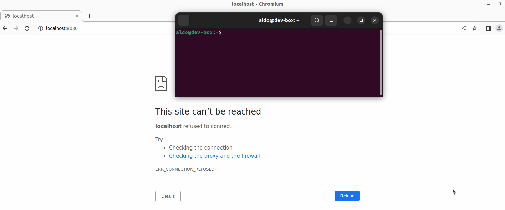

### Instalación a partir de una imagen Docker

Primero instalamos la imagen de Jenkins en un directorio especialmente creado para este propósito:

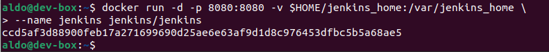

Pedimos logs para verificar que se instaló correctamente:

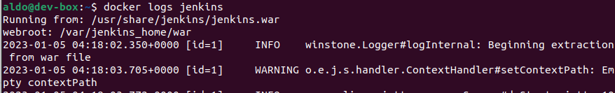

### Configuración inicial

Entramos a la dirección <http://localhost:8080>. Nos pide una contraseña de administrador. Copiamos y pegamos la que salió en los logs:

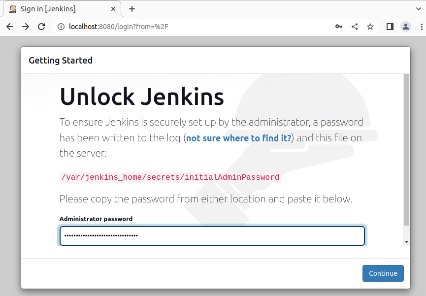

Instalamos los plugins sugeridos de Jenkins:

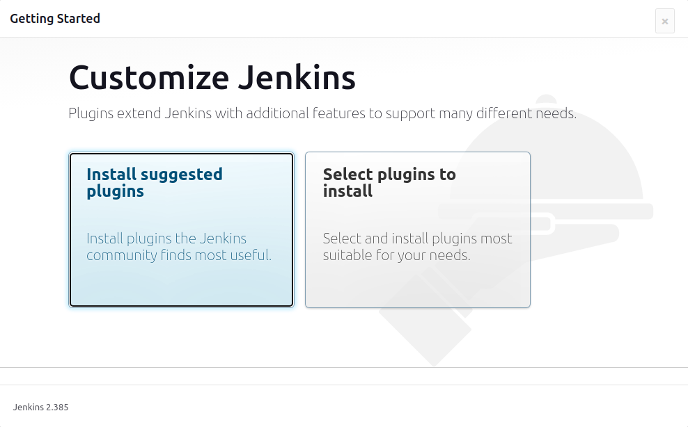

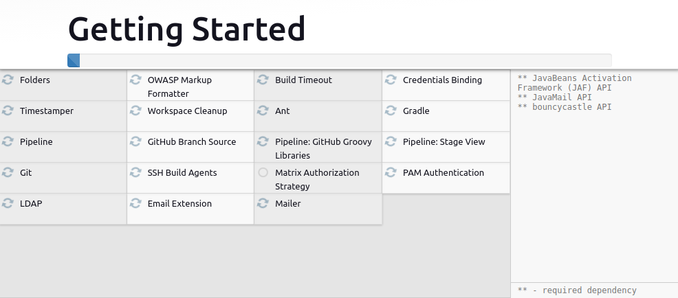

Configuramos la cuenta con la que se accederá a Jenkins:

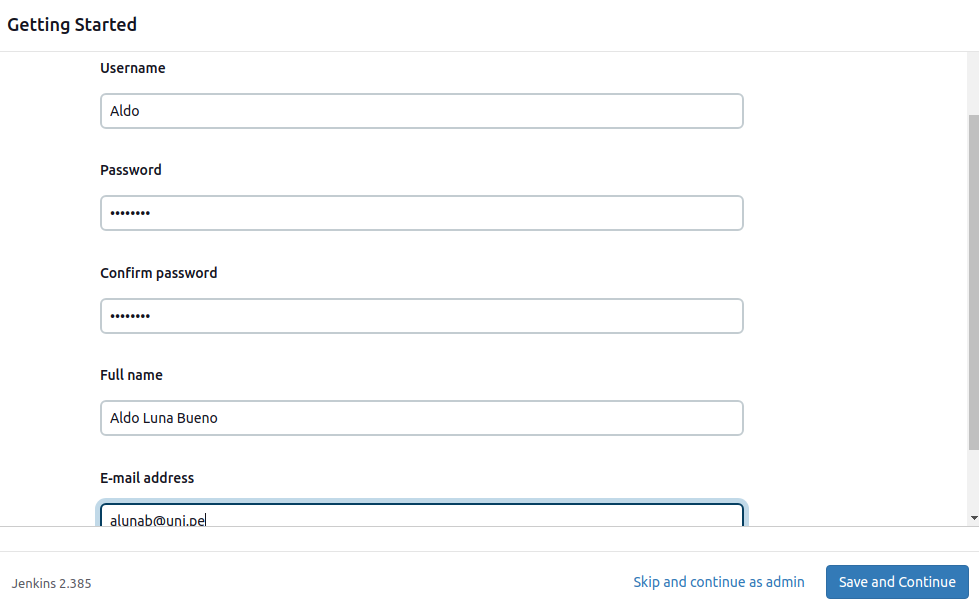

Muestra la URL de Jenkins:

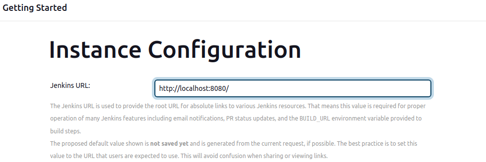

Se muestra el Dashboard de Jenkins, con lo cual ya podemos usar la herramienta:

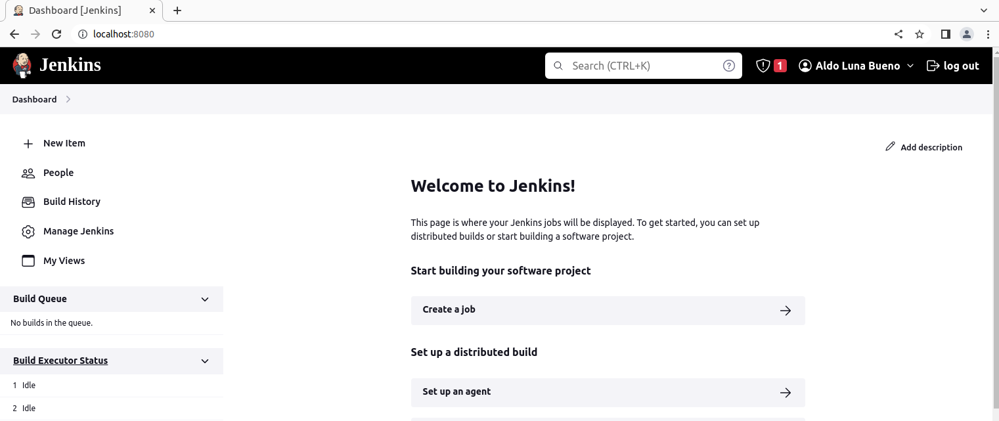

## El «Hola, mundo» de Jenkins

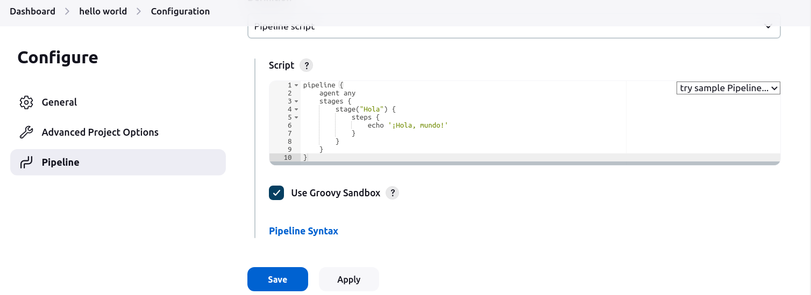

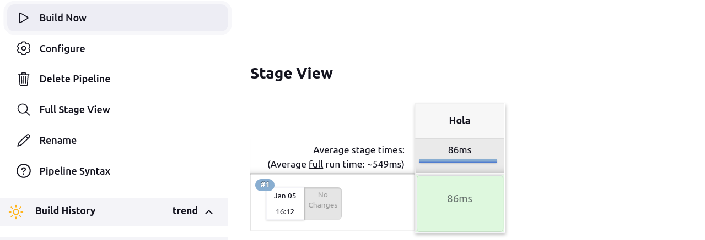

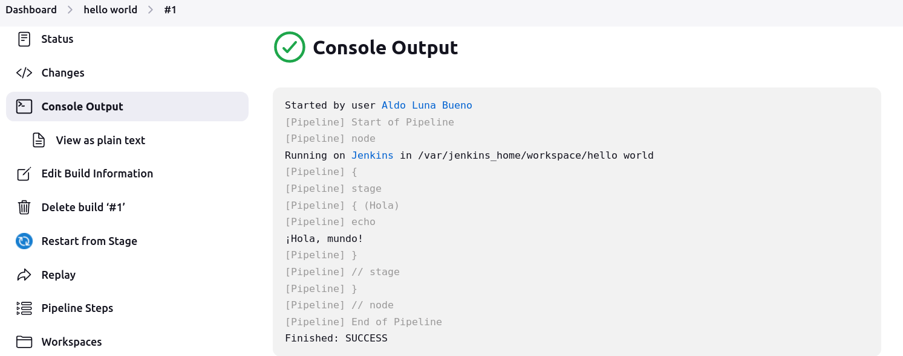

## Arquitectura de Jenkins

Jenkins se sobrecarga rápido, así que a menos que que tu proyecto sea pequeños, no debe ejecutar ningún construcción de código fuente (como maestro), sino delegarlas a instancias del agente (esclavo).

## Configuración de agentes permanentes

> Los agentes son los nodos que no son nodos build-in (incorporados).

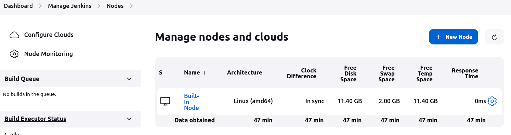

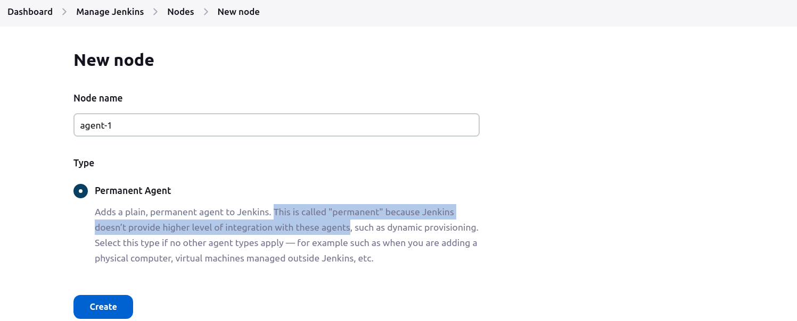

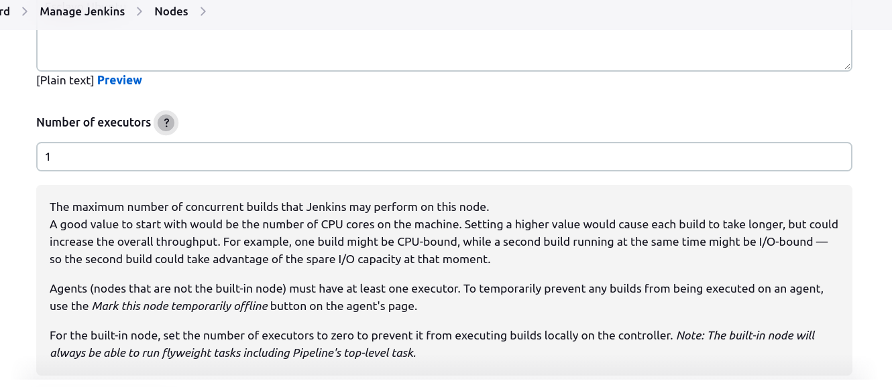

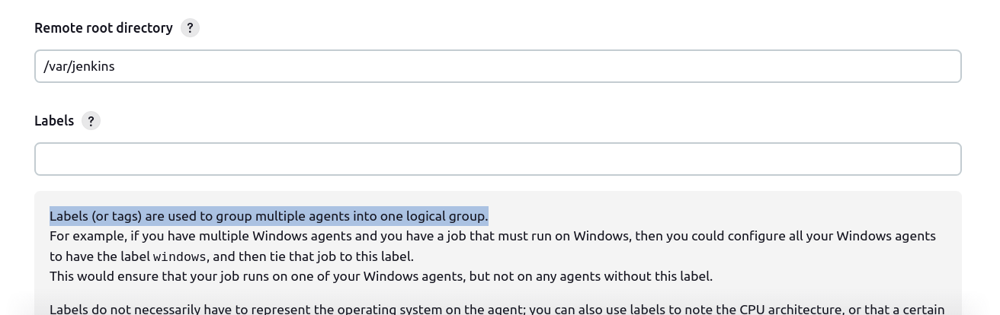

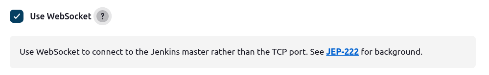

Creamos el agente _agent-1_:

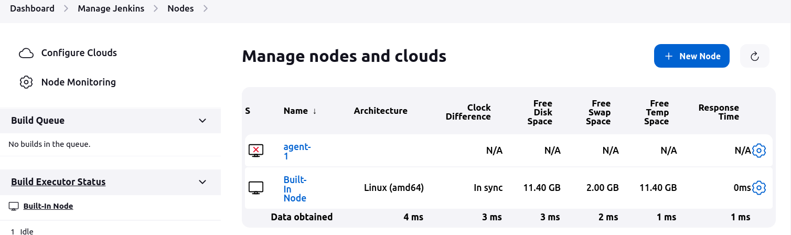

**Notas:**
* Se llama agente permanente porque Jenkins no provee un alto nivel de integración con estos agentes, como sí es el caso del provisionamiento dinámico.
* Los _labels_ o _tags_ ‘etiquetas’ se usan para agrupar múltiples agentes dentro de un mismo grupo lógico.
* El método de lanzamiento _Launch agent by connecting it to the controller_ permite a un agente conectarse al controlador Jenkins cuando esté listo. 
* Built-In Node
This is the Jenkins controller's built-in node. Builds running on this node will execute on the same system and as the same user as the Jenkins controller. This is appropriate e.g. for special jobs performing backups, but in general you should run builds on agents.

## Prueba de agentes

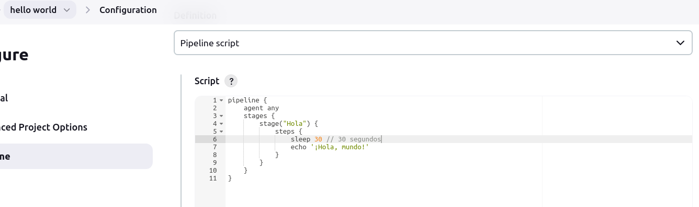
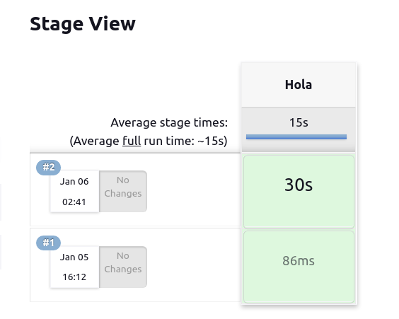

No pudimos observar dónde dice que esta tarea fue ejecutada por el agente.
