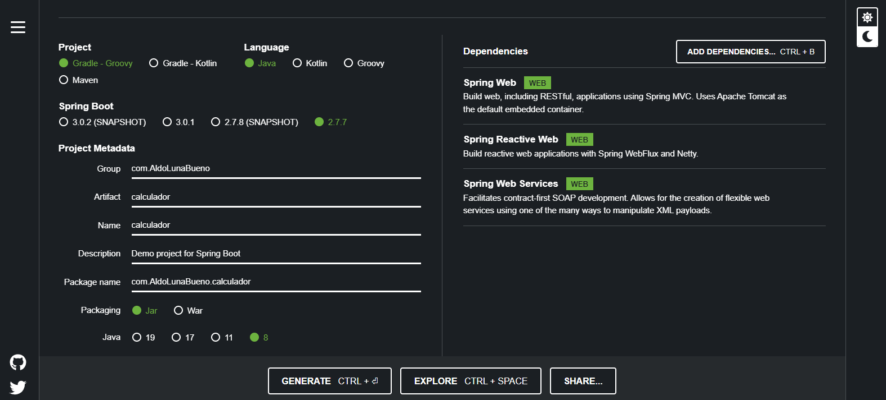

# Actividad 21. Pipelines de integración continua (CI)

## Introducciones a los pipelines

Un pipeline consta de dos elementos: stage y step.

Creamos un pipeline _hello world 2_ de dos etapas y tres pasos usando la sintaxis declarativa:

Lo ejecutamos, y esta es su salida en consola:

## Commit pipeline de prueba: calculador

Creamos en nuestra cuenta de GitHub el repositorio _calculador_:

Creamos el pipeline _calculador_ cuyo objetivo es descargar el código del repositorio del mismo nombre (todavía no hay código ahí, pero la idea es esa).

Comprobamos que el pipeline _calculador_ se ejecutó con éxito en la salida de la consola:

## Compilación (compile)

Para compilar un proyecto, necesitamos hacer lo siguiente:
1. Crea un proyecto con el código fuente.
2. Push al repositorio.
3. Agrega la etapa compile al pipeline.

Creamos el proyecto Spring Boot en https://start.spring.io/ como sigue:

Hacemos push al código a GitHub

