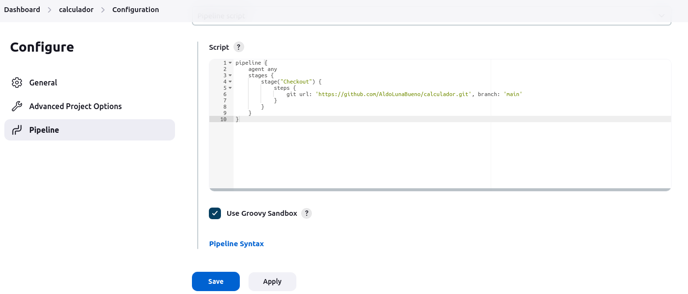
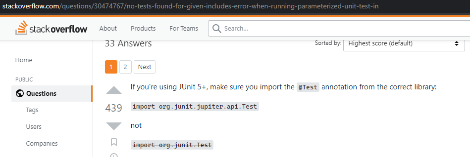
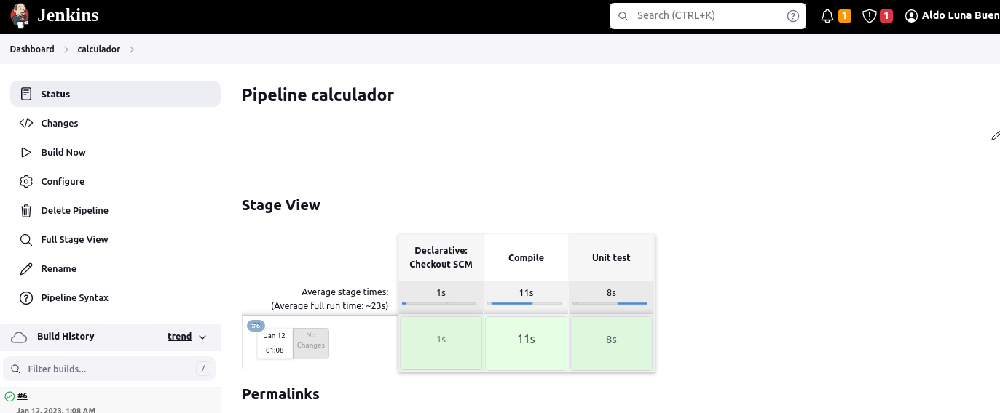

# Actividad 21. Pipelines de integración continua (CI)

- [Actividad 21. Pipelines de integración continua (CI)](#actividad-21-pipelines-de-integración-continua-ci)
  - [Introducciones a los pipelines](#introducciones-a-los-pipelines)
  - [Compilación (compile)](#compilación-compile)
  - [Pruebas unitarias](#pruebas-unitarias)
    - [La lógica de negocios y su exposición como servicio web](#la-lógica-de-negocios-y-su-exposición-como-servicio-web)
    - [Escribiendo una prueba unitaria](#escribiendo-una-prueba-unitaria)
    - [Creación de una etapa de prueba unitaria](#creación-de-una-etapa-de-prueba-unitaria)
  - [Jenkinsfile](#jenkinsfile)

## Introducciones a los pipelines

Un pipeline consta de dos elementos: stage y step.

Creamos un pipeline _hello world 2_ de dos etapas y tres pasos usando la sintaxis declarativa:

Lo ejecutamos, y esta es su salida en consola:

## Commit pipeline de prueba: calculador

Creamos en nuestra cuenta de GitHub el repositorio _calculador_:

Creamos el pipeline _calculador_ cuyo objetivo es descargar el código del repositorio del mismo nombre (todavía no hay código ahí, pero la idea es esa).

Comprobamos que el pipeline _calculador_ se ejecutó con éxito en la salida de la consola:

## Compilación (compile)

Para compilar un proyecto, necesitamos hacer lo siguiente:
1. Crea un proyecto con el código fuente.
2. Push al repositorio.
3. Agrega la etapa compile al pipeline.

Creamos el proyecto Spring Boot en https://start.spring.io/

Escogemos la versión más antigua de Spring Boot, elegimos Java 8 y agregamos la depencencia Spring web.

Clonamos el repositorio _calculador_. Desplegamos el contenido del archivo del proyecto de Spring Boot en la carpeta correspondiente a este repositorio. Luego usamos InteliJ IDEA para construir los archivos Gradle (nos aparece una opción en la esquina inferior derecha).

Nuestro proyecto de Gradle compila localmente con el comando `./gradle compileJava`:

Aquí se ve que ya hicimos el push a través de InteliJ IDEA:

Vamos a Jenkins y creamos la etapa compile al pipeline calculator:

Ejecutamos el pipeline. Esta es su salida en consola:

Se demoró un poco en invocar al demonio de Gradle, pero al final la compilación fue exitosa.

## Pruebas unitarias

### La lógica de negocios y su exposición como servicio web

Agregamos dos clases: _Calculador.java_ y _CalculadorController.java_. La primer contiene la lógica empresarial y la segunda expone dicha lógica como un servicio web. 

No hubo ningún problema con la compilación del proyecto, pero sí al ejecutarlo con el comando `./gradlew bootRun`:

Esto se debió a que está usando el puerto 8080, mismo puerto que usa Jenkins, así que primero, si queremos ejecutarlo localmente, hay que parar el contenedor de Jenkins en el terminal con `docker stop jenkins`.

Ya podemos ir al navegador y hacer un request para usar la operación de suma. Con esta URL sumamos los números a=1 y b=2 y en la página nos sale un resultado de 3: http://localhost:8080/sum?a=1&b=2

### Escribiendo una prueba unitaria

Para agregar las dependencias nos ayudamos del buscador de dependencias de InteliJ IDEA:

Y ahora solo tenemos que cargar las dependencias dándole al ícono de Gradle que sale arriba a la derecha:

Al correr la prueba unitaria tuve el siguiente error:

Era porque la línea de código para importar de JUnit5 la anotación @Test era incorrecta, como explican aquí:

Ahora sí funciona:

Usamos el ícono de ejecución que nos ofrece InteliJ IDEA, pero también podemos usar en el terminal el comando `./gradlew test`:

Hacemos commit y push a nuestro repositorio a través de nuestro IDE:

### Creación de una etapa de prueba unitaria

Agregamos la etapa _Unit test_ al pipeline para ejecutar las pruebas unitarias:

Esta vez fue más rápido construir el pipeline a pesar de que ahora es un pipeline completo de integración continua:

## Jenkinsfile

> - La apariencia de un pipeline está estrictamente relacionada con el proyecto en sí.
> - Los pipelines deben ser
creados por las mismas personas que escriben el código: los desarrolladores.
> - La definición de pipeline debe estar junto con el código, en el repositorio.

Creando el archivo Jenkinsfile

Ahora ejecutamos el pipeline desde el Jenkinsfile. Para esto cambiamos en configuración la opción de _Pipeline script_ por la de _Pipeline script from **SCM**_ (Source Control Management):

Fnciona a la perfección a pesar de que ya no tenemos ningún script definido dentro de Jenkins:

Con esto concluimos con éxito nuestro primero commit pipeline completo de integración continua.
