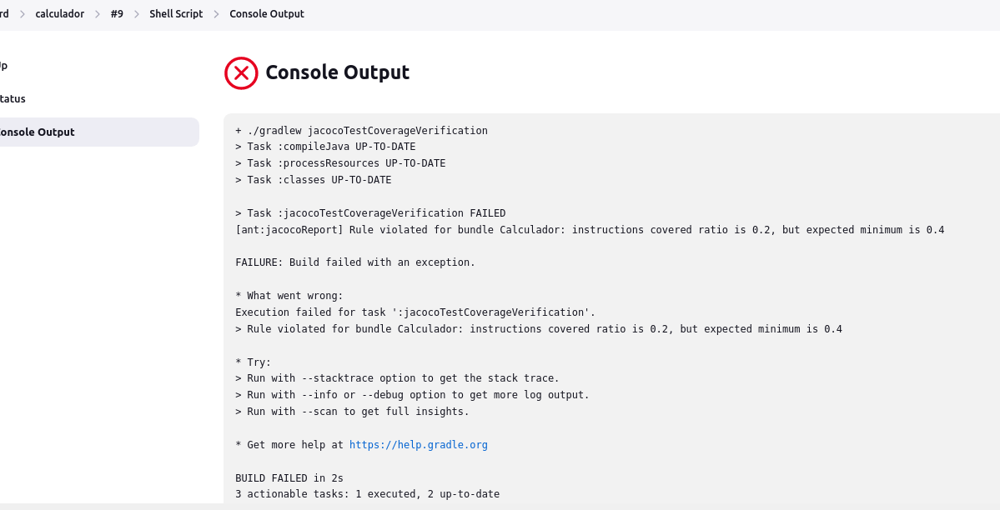
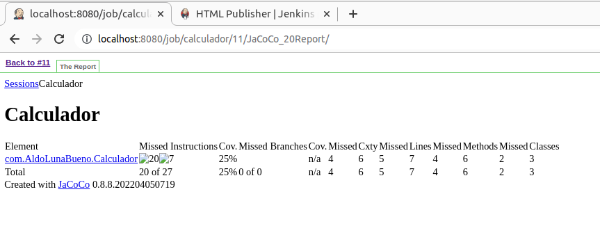

# Actividad 22. Mejoras al pipeline de integración continua (CI)

## Etapas de calidad de código

### Cobertura de código

Agregamos JaCoCo a Gradle en el archivo build.gradle y cargamos el nuevo plugin dando clic en el ícono de Gradle que emerge arriba a la derecha:

También agregamos la siguiente configuración de verificación de los tests:

Para probar la cobertura del código con JaCoCo ejecutamos el comando `./gradlew test jacocoTestCoverageVerification`. Nos sale que no hay ningún error, pero queremos saber más.

Inspeccionamos el reporte completo en _build/reports/jacoco/test/html/index.html_ y vemos que la covertura es del 100 %:

Ahora, si comento todo el código de los tests, JaCoCo debería lanzar un mensaje de error, pero no lo hace:

Inspeccionamos el reporte completo como antes y nos damos cuenta de que, según JaCoCo, el código tiene una covertura del 33 %:

No tiene mucho sentido sentido, pero al aumentar el límite mínimo a 0.4 ya nos sale el mensaje de error «covered ratio is 0.3, but expected minimum is 0.4»:

Y ahora vamos a ver que esto mismo ocurre cuando lo construimos con Jenkins. 

Primero añadimos la nueva etapa de covertura:

Hacemos un push de estos cambios a nuestro repositorio y construimos el pipeline desde Jenkins. Debe fallar en la etapa de covertura de ćodigo:

No pudimos ver un enlace para abrir el reporte en el navegador, pero se puede consultar los logs de la etapa de covetura:

Nos falta este plugin:

Reiniciamos Jenkins y ahora sí se muestra un botón que permite visualizar el reporte en el mismo navegador. Se encuentra en el panel de la izquierda que se muestra al hacer clic en la construcción:

Y así se ve:

### Analisis de código estático

