# Actividad 23. Pruebas de aceptación automatizadas (UAT)

Creamos una cuenta de Docker Hub:

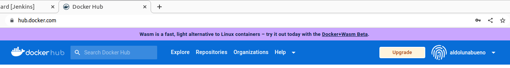


## Docker Registry

```
docker run -d -p 443:443 --restart=always --name registry -v `pwd`/certs:/certs -e REGISTRY_HTTP_ADDR=0.0.0.0:443 -e REGISTRY_HTTP_TLS_CERTIFICATE=/certs/domain.crt -e REGISTRY_HTTP_TLS_KEY=/certs/domain.key registry:2
```
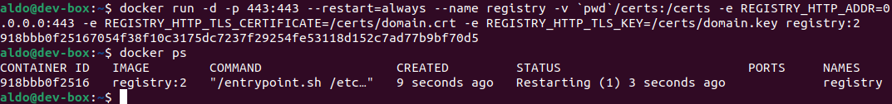

```
docker run --entrypoint htpasswd httpd:2 -Bbn username password > auth/htpasswd
```

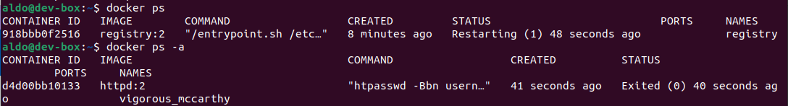

```
docker ps
docker stop registry
docker rm registry
```

```
docker run -d -p 443:443 --restart=always --name registry -v `pwd`/auth:/auth -e "REGISTRY_AUTH=htpasswd" -e "REGISTRY_AUTH_HTPASSWD_REALM=Registry Realm" -e REGISTRY_AUTH_HTPASSWD_PATH=/auth/htpasswd -v `pwd`/certs:/certs -e REGISTRY_HTTP_ADDR=0.0.0.0:443 -e REGISTRY_HTTP_TLS_CERTIFICATE=/certs/domain.crt -e REGISTRY_HTTP_TLS_KEY=/certs/domain.key registry:2
```

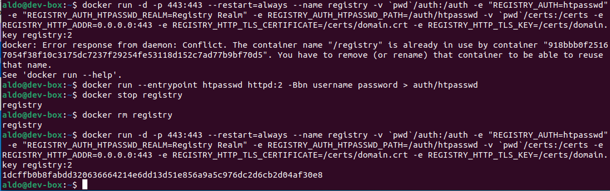

> El comando, además de establecer los certificados, crea una restricción de acceso limitada a los usuarios especificados en el archivo auth/passwords. Como resultado, antes de usar el registro, el cliente debe especificar el nombre de usuario y la contraseña.

### Construyendo una imagen

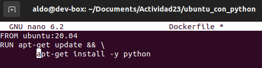

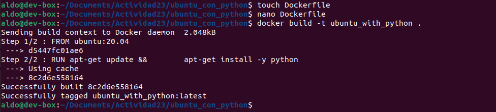

### Realizamos un pushing de la imagen hacia el registro

```
docker login --username aldolunabueno --password *********
```

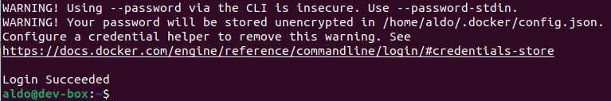

Ahora ya podemos hacer el push hacia el registro:

```
docker push aldolunabueno/ubuntu_with_python:1
```

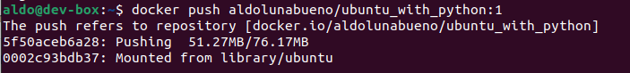

Comprobamos en Docker Hub que efectivamente la imagen _ubuntu_with_python_ se publicó:

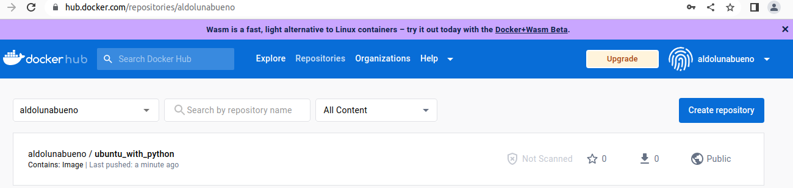

### Realizamos un pulling de la imagen desde el registro

Borramos la imagen:

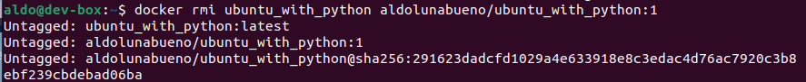

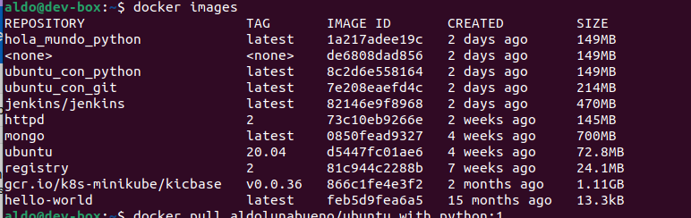

Ahora la recuperamos del registro:

```
docker pull aldolunabueno/ubuntu_with_python:1
```

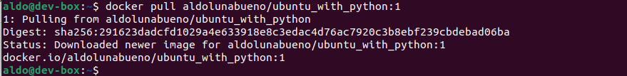

Confirmamos que la imagen está de vuelta:

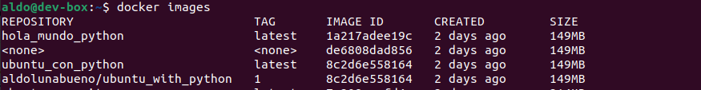


## Pruebas de aceptación en el pipeline de Jenkins

