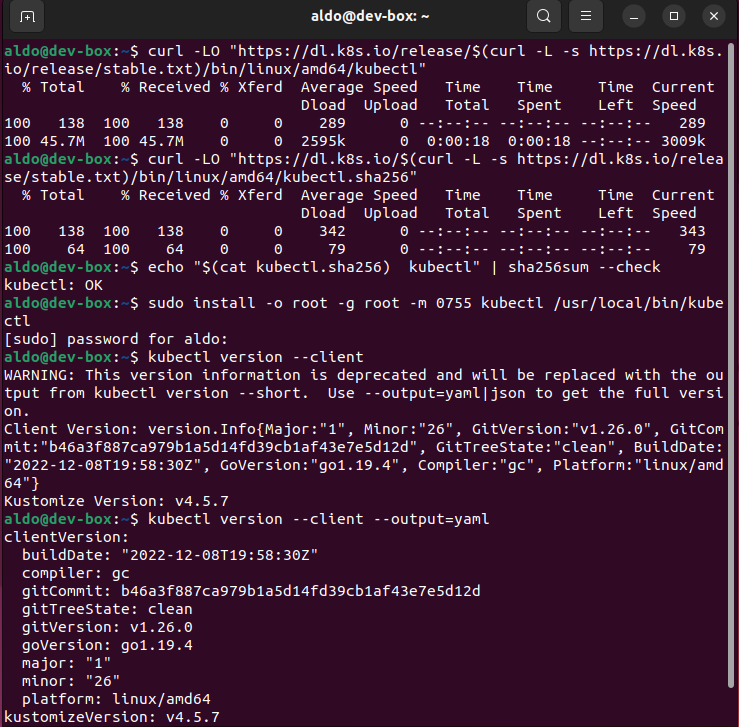

# Actividad 24. Clustering con Kubernetes

## Instalación de Kubernetes

https://kubernetes.io/docs/tasks/tools/install-kubectl-linux/#install-kubectl-on-linux

## Instalación de Minikube

https://minikube.sigs.k8s.io/docs/start/

