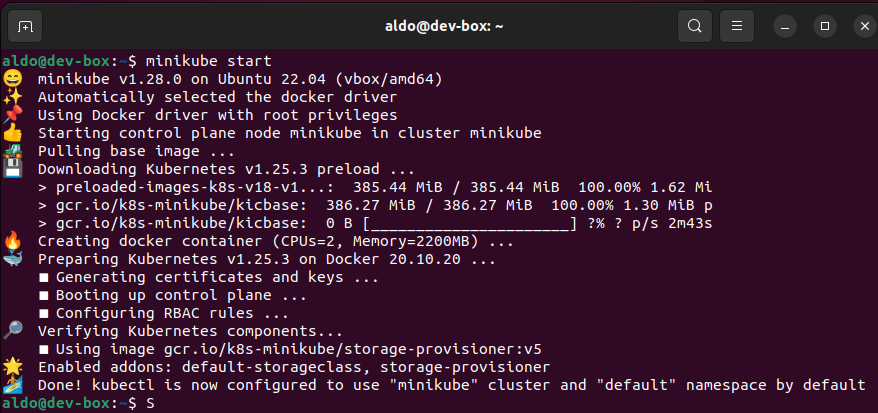

# Actividad 24. Clustering con Kubernetes

## Instalación de Kubernetes y de Minicube

Kubernetes se instaló correctamente siguiendo [la documentación oficial](https://kubernetes.io/docs/tasks/tools/install-kubectl-linux/#install-kubectl-on-linux):

Minikube se instaló correctamente siguiendo [la documentación oficial](https://minikube.sigs.k8s.io/docs/start/):

